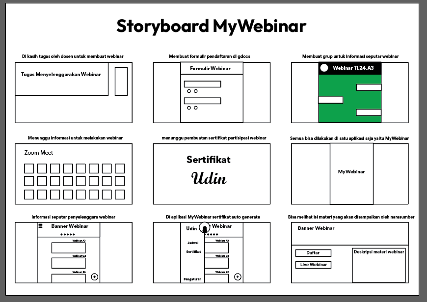
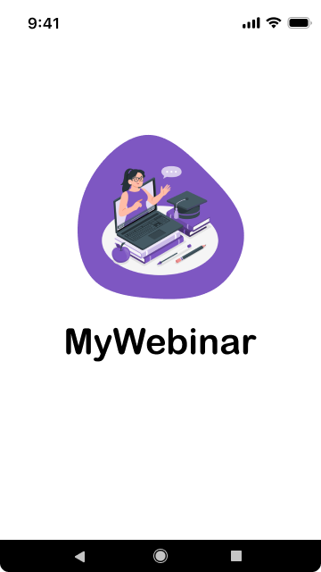
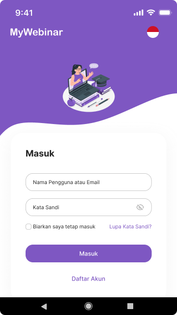
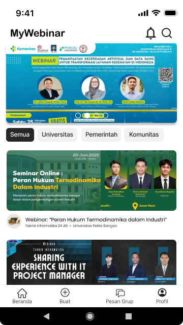
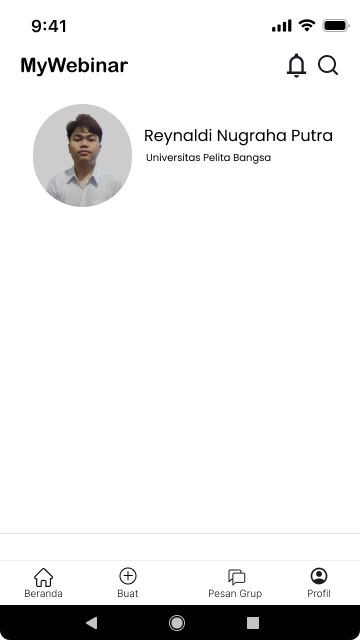

# Aplikasi MyWebinar
### Nama : Reynaldi Nugraha Putra
### NIM : 312410278
### Kelas : TI.24.A3
### Mata Kuliah : Pemrograman Mobile Pertemuan 8 / UTS
# 

### 1. Splash Screen

  
  
  

### 2. StoryBoard Project

### 3. Mockup Project

### 4. UI (User Interface) Project

  
  
  

  
  
  

### 5. UX (User Experience) VIDEO PROTOTYPE Project

