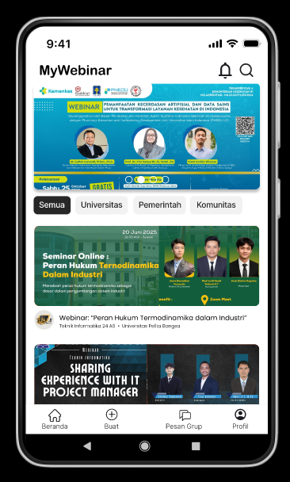
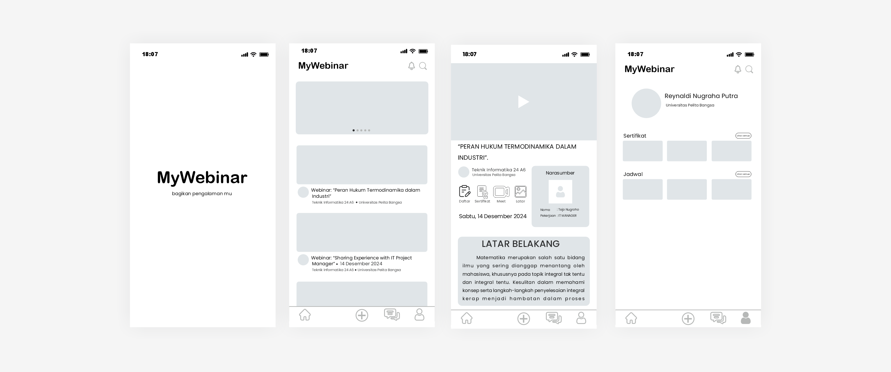

# Aplikasi MyWebinar
### Nama : Reynaldi Nugraha Putra
### NIM : 312410278
### Kelas : TI.24.A3
### Mata Kuliah : Pemrograman Mobile Pertemuan 8 / UTS
# 

### 1. Splash Screen

  
  
  

### 2. StoryBoard Project

### 3. Mockup Project

### 4. Wireframe 

### 5. UI (User Interface) Project

  
  
  

  
  
  

### 6. UX (User Experience) VIDEO PROTOTYPE Project

### 6. Link Project

  🔗 <a href="https://app.clickup.com/123456789" target="_blank">Buka ClickUp Project</a> 
  🎨 <a href="https://www.figma.com/file/abcdefghij/MyWebinar-Design" target="_blank">Lihat Desain Figma</a>

