# Aplikasi MyWebinar
### Nama : Reynaldi Nugraha Putra
### NIM : 312410278
### Kelas : I241D
### Mata Kuliah : Pemrograman Mobile Pertemuan 8 / UTS
### Dosen Pengampu : Donny Maulana, S.Kom., M.M.S.I.[cite: 5]
# 

## 📝 Deskripsi Project (Update UTS)
Proyek ini merupakan implementasi aplikasi **MyWebinar** pada Android Studio[cite: 5]. Aplikasi ini berfungsi untuk manajemen pendaftaran webinar, akses sertifikat, dan kini telah dilengkapi dengan fitur **AI Chatbot** sebagai asisten cerdas bagi pengguna[cite: 5].

### Fitur Terbaru: AI Chatbot Asisten
*   **Integrasi AI**: Menggunakan API untuk menjawab pertanyaan seputar jadwal dan teknis webinar[cite: 5].
*   **Smart Assistant**: Membantu pengguna melakukan pencarian topik webinar secara otomatis melalui perintah teks[cite: 5].

---

### 1. Splash Screen

  
  
  

 

### 2. StoryBoard Project

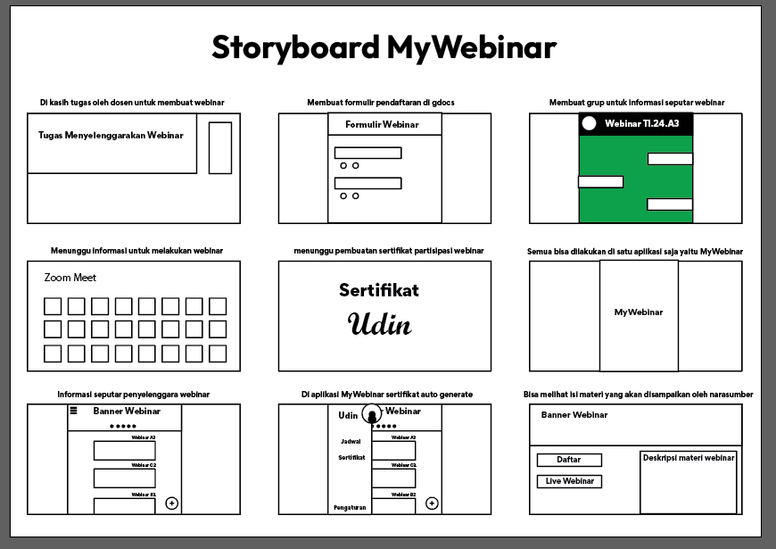

 

### 3. Mockup Project

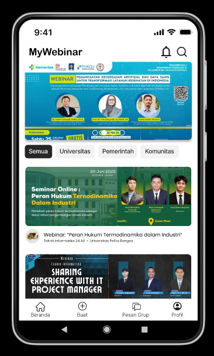

 

### 4. Wireframe 

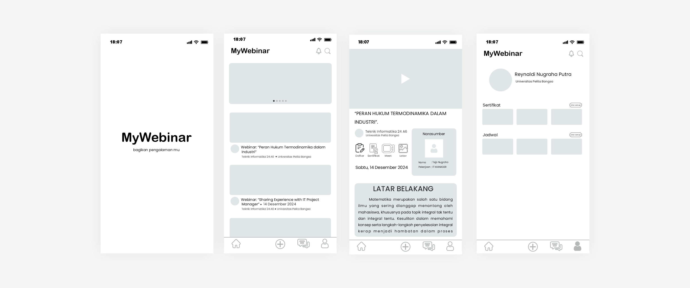

 

### 5. UI (User Interface) Project

  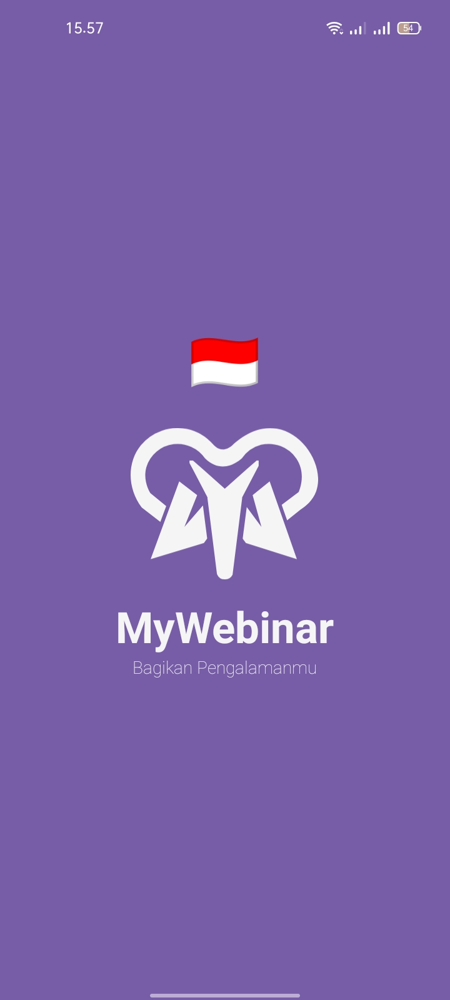
  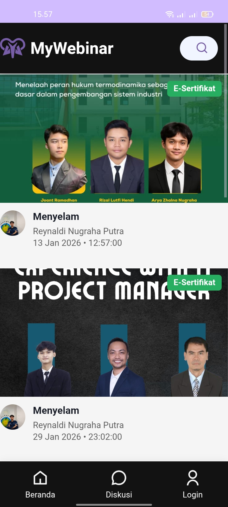
  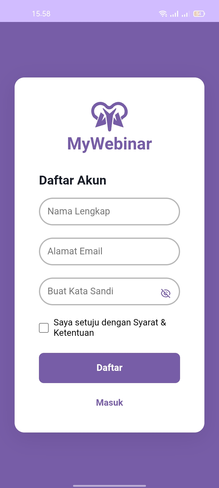
  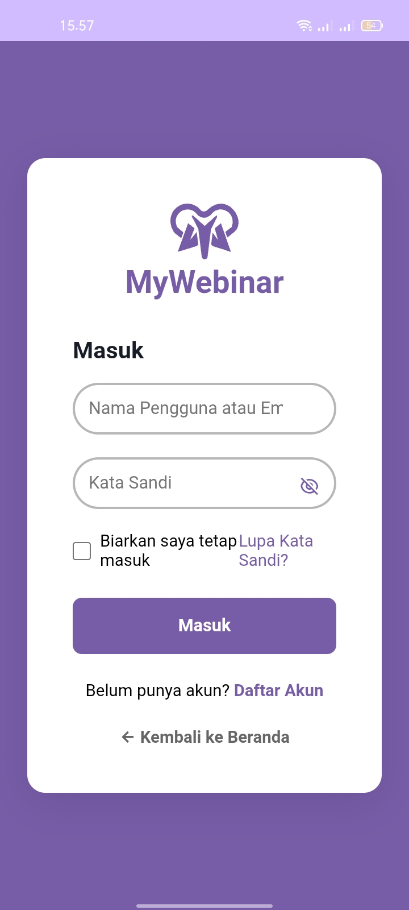
  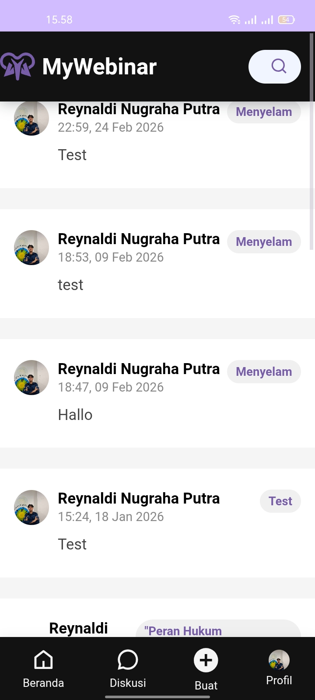
  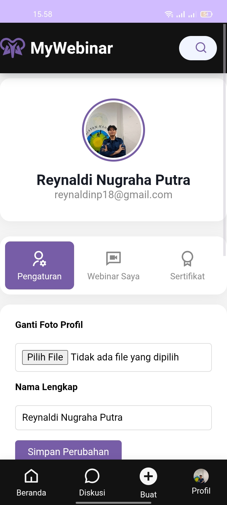
  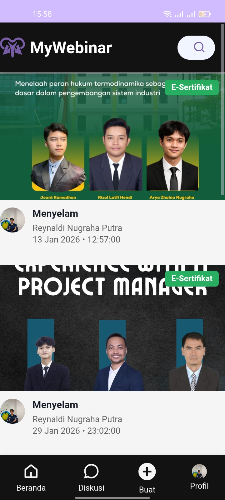
  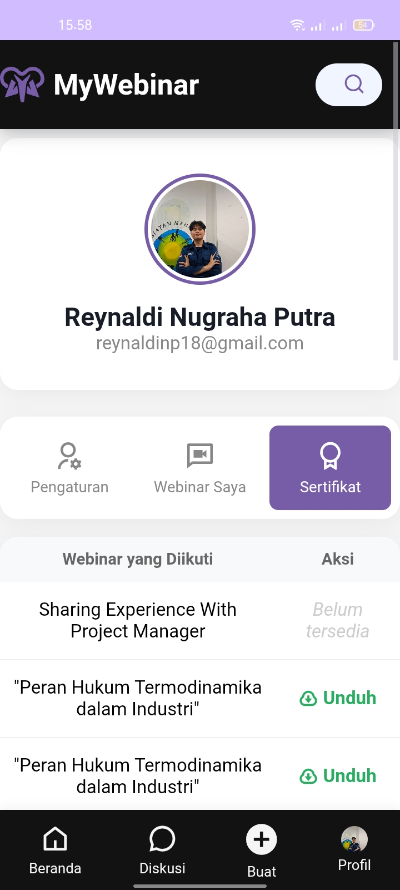
  
  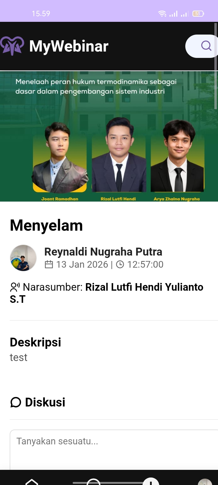
  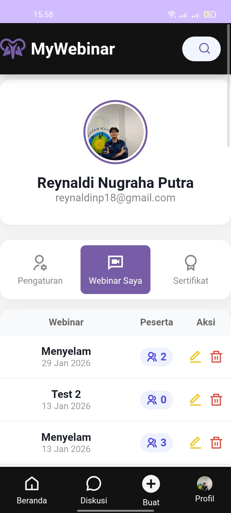
  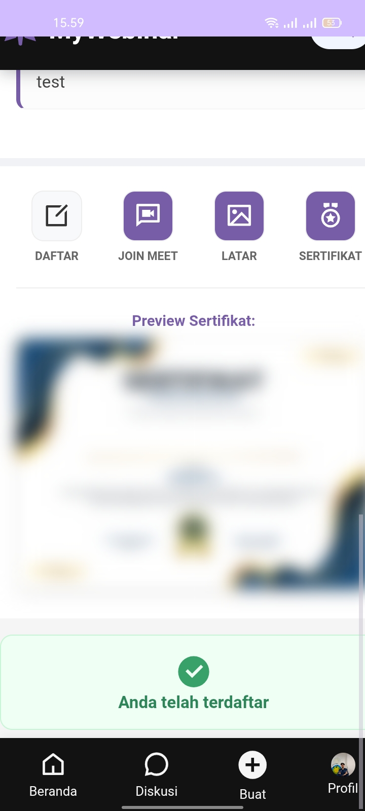
  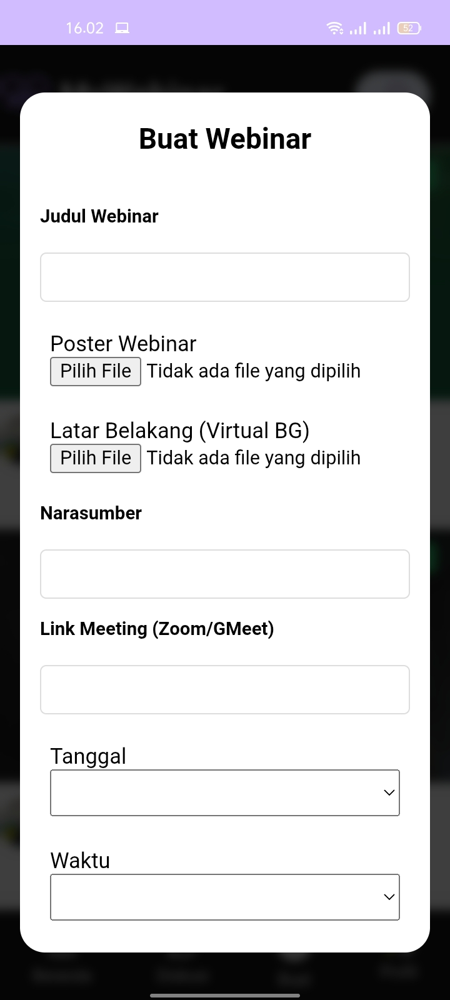

 

### 6. UX (User Experience) VIDEO PROTOTYPE Project

 

### 7. Timeline Project ClickUp
- [ClickUp](https://sharing.clickup.com/90181810261/g/h/2kzm2e2n-658/ecff08a3c6fdc3c)
 

 ### 8. Figma Wireframe
- [Link Figma](https://www.figma.com/design/iwjr289lMfDCBZmQjJ0kks/MyWebinar-UI-UX-Design?node-id=1-18&t=Lw9OMroXqJQALsfL-1))

Tentu, Rizki. Berikut adalah draf **README.md** yang telah diperbarui sesuai dengan instruksi UTS Pemrograman Mobile 2[cite: 5]. Saya telah menyesuaikan informasi mata kuliah, menambahkan deskripsi fitur AI Chatbot terbaru, serta menyertakan tabel progres pengerjaan tanpa menghapus referensi gambar yang sudah ada.

---

# Aplikasi MyWebinar - Update AI Chatbot
### Nama : Reynaldi Nugraha Putra[cite: 5]
### NIM : 312410278[cite: 5]
### Kelas : I241D[cite: 5]
### Mata Kuliah : Pemrograman Mobile 2 (UTS)[cite: 5]
### Dosen Pengampu : Donny Maulana, S.Kom., M.M.S.I.[cite: 5]

---

### 1. Splash Screen

  
  
  

 

### 2. StoryBoard Project

 

### 3. Mockup Project

 

### 4. Wireframe 

 

### 5. UI (User Interface) Project & Update Feature

  
  
  
  
  
  
  
  
  
  
  
  
  
  <!-- Gambar Update Chatbot yang dikirim user -->
  
  

 

### 6. UX (User Experience) VIDEO PROTOTYPE Project

 

### 7. Timeline Project & Progress SCRUM (ClickUp)
Pengembangan fitur AI Chatbot mengikuti jadwal *Gantt Chart* yang telah disusun untuk memastikan target finalisasi tercapai tepat waktu.

| Task | Start Date | End Date | Status |
| :--- | :--- | :--- | :--- |
| Inisiasi & Analisis AI | 01 Apr 2026 | 09 Apr 2026 | Selesai |
| Perancangan UI/UX & Arsitektur | 10 Apr 2026 | 14 Mei 2026 | Selesai |
| Pengembangan Core & AI Chatbot | 15 Mei 2026 | 11 Jun 2026 | Sedang Berjalan |
| Testing & Bug Fixing | 12 Jun 2026 | 09 Jul 2026 | Mendatang |
| Dokumentasi & Finalisasi | 10 Jul 2026 | 31 Jul 2026 | Mendatang |

*   **Link ClickUp**: [Klik di sini untuk melihat Progress SCRUM](https://sharing.clickup.com/90181810261/l/h/6-901812352277-1/a8aa826a9dc67d3)[cite: 5]

 

### 8. Figma Wireframe
- [Link Figma Design](https://www.figma.com/design/iwjr289lMfDCBZmQjJ0kks/MyWebinar-UI-UX-Design?node-id=1-18&t=Lw9OMroXqJQALsfL-1)

---

### 9. Cara Instalasi (Technical Requirements)
1.  Clone repository ini[cite: 5].
2.  Buka project menggunakan **Android Studio**[cite: 5].
3.  Pastikan API Key untuk AI Chatbot sudah terkonfigurasi di file `gradle.properties` atau `local.properties`.
4.  Jalankan aplikasi menggunakan Emulator atau Real Device.

---

Pastikan kamu sudah memasukkan file gambar WhatsApp yang tadi kamu kirim ke folder repository kamu agar link `` di atas bisa menampilkan gambar dengan benar. Ada lagi yang perlu saya bantu untuk UTS ini?
